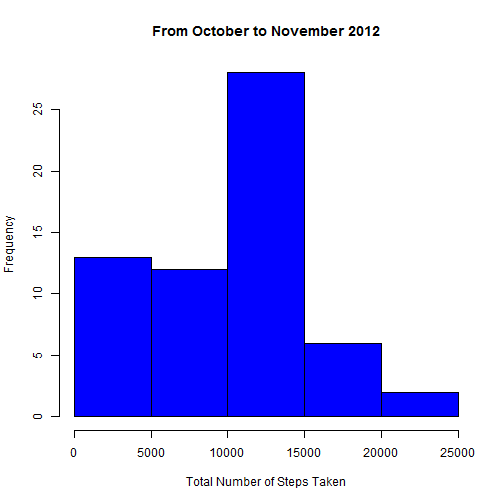
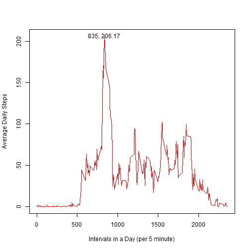
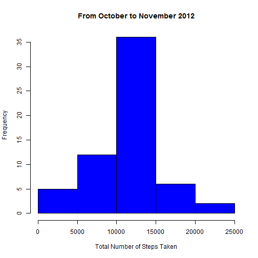
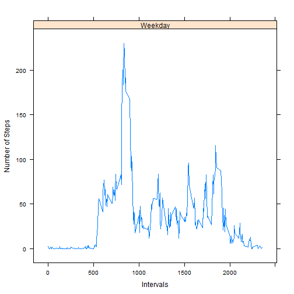
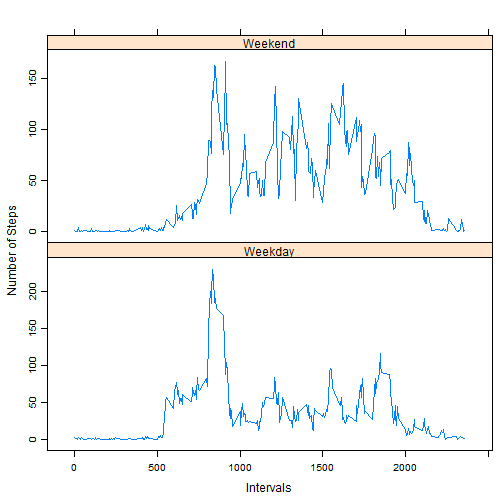

Reproducible Research - Peer Assignment 1
============================================

To the Assignment's objectives, let us analyze this data together.

The 2 months worth of data used here is credited to an anonymous individual, who used an actiity monitoring device that collected the data during the months of October and November, 2012 and include the number of steps taken in 5 minute intervals each day.

To use this R Markdown document, you will need to have the lattice and latticeExtra package installed in your R software.

First, we shall load the data into R. The dataset is contained in a comma-separated value Excel File.


```r
data = read.csv("activity.csv", stringsAsFactors=FALSE)
```

### Histogram of Steps Taken

The data is not meaningful without a graphical representation. We shall take a look at the distribution of the total number of steps taken for this individual. NA values are ignored.
  


```r
sum_1 = data.frame()
dates = unique(data$date)

for (i in seq(dates)) {
        
        temp = dates[i]
        by_date = subset(data, grepl(temp, data$date))
        sum_by_date = sum(by_date$steps, na.rm=TRUE)
        sum_1 = rbind(sum_1, sum_by_date)
        
}

colnames(sum_1) = "total"
total_sum_1 = cbind(dates, sum_1)
summary(total_sum_1)
```

```
##         dates        total      
##  2012-10-01: 1   Min.   :    0  
##  2012-10-02: 1   1st Qu.: 6778  
##  2012-10-03: 1   Median :10395  
##  2012-10-04: 1   Mean   : 9354  
##  2012-10-05: 1   3rd Qu.:12811  
##  2012-10-06: 1   Max.   :21194  
##  (Other)   :55
```

```r
hist(total_sum_1$total, col="blue", main = "From October to November 2012", xlab="Total Number of Steps Taken")
```

 

```r
summary(total_sum_1)
```

```
##         dates        total      
##  2012-10-01: 1   Min.   :    0  
##  2012-10-02: 1   1st Qu.: 6778  
##  2012-10-03: 1   Median :10395  
##  2012-10-04: 1   Mean   : 9354  
##  2012-10-05: 1   3rd Qu.:12811  
##  2012-10-06: 1   Max.   :21194  
##  (Other)   :55
```

  
Just to get an idea of how long a step is, here is a brief reference on an online site.


*"Maybe you have heard the recent guidelines about walking 10,000 steps per day. How far is 10,000 steps anyway? The average person's stride length is approximately 2.5 feet long. That means it takes just over 2,000 steps to walk one mile, and 10,000 steps is close to 5 miles."*


~ The Walking Site, <http://www.thewalkingsite.com/10000steps.html>

  
Per day, this individual has walked an average of 9354 steps, and the median is 10395 steps.

From this simple aggregation, we can see that this person did not hit the average given by the Walking Site. Possible reasons may include a spoilt pedometer, and largely attributable to missing data.

## Average Daily Pattern

However, the histogram paints only an accurate picture of the steps taken, but not across the intervals. We will use a time series to analyze the changes across time.

A sample output of the data table used is provided below:


```r
average_1 = data.frame()

for (i in unique(data$interval)) {
        
        temp = data[data$interval==i,]
        temp2 = mean(temp$steps, na.rm=TRUE)
        average_1 = rbind(average_1, temp2)
        
}

colnames(average_1) = "average"
intervals = unique(data$interval)
average_final = cbind(intervals, average_1)
print(head(average_final))
```

```
##   intervals average
## 1         0 1.71698
## 2         5 0.33962
## 3        10 0.13208
## 4        15 0.15094
## 5        20 0.07547
## 6        25 2.09434
```


The time series plot is as below:


```r
plot(average_final$intervals, average_final$average, type = "l", col = "red", xlab = "Intervals in a Day (per 5 minute)", ylab = "Average Daily Steps")
max_step = max(average_final$average)
max_interval = with(average_final, intervals[average==max_step])
text(max_interval, max_step, labels = "835, 206.17")
```

 

From the time series, we can see the interval that has the maximum number of average steps is the 835th minute, or 8:35am. Hence, we can see that the individual is the most active at 8.35am in his average daily pattern.

## Inputting Missing Values

Per the Assignment, we will look into replacing missing values. We need to know how many NAs are there in the data first.


```r
table(is.na(data))
```

```
## 
## FALSE  TRUE 
## 50400  2304
```

We can see that there are 2304 NA values (where every NA value to be counted is a sum of 1, and every non NA value to be a sum of 0) in the data set. For the purposes of the Assignment, I shall use only the mean of each interval to fill in for the missing values in the original dataset. A sample output of the replaced values is provided below.


```r
refreshed_data = data.frame()

for (i in unique(data$interval)) {
        
        temp = average_final[average_final$intervals==i,]
        by_interval = data[data$interval==i,]
        replaced_na = replace(by_interval, is.na(by_interval), temp$average)
        refreshed_data = rbind(refreshed_data, replaced_na)
        
}

print(head(refreshed_data))
```

```
##       steps       date interval
## 1     1.717 2012-10-01        0
## 289   0.000 2012-10-02        0
## 577   0.000 2012-10-03        0
## 865  47.000 2012-10-04        0
## 1153  0.000 2012-10-05        0
## 1441  0.000 2012-10-06        0
```

As compared to the previous table,


```r
print(head(average_final))
```

```
##   intervals average
## 1         0 1.71698
## 2         5 0.33962
## 3        10 0.13208
## 4        15 0.15094
## 5        20 0.07547
## 6        25 2.09434
```

We can see that the NA values in the refreshed dataset has been replaced with the average value, eg. at interval 0, the average value of 1.717 has been slotted into the NA value.


Next, we will have to look at the impact of these newly inserted values into the original data set, which is conveniently named as "refreshed_data" to set the difference. We will conduct a histogram analysis, where we will see the average number of steps taken per day, at every interval. A sample output is given below.


```r
sum_2 = data.frame()
dates = unique(refreshed_data$date)

for (i in seq(dates)) {
        
        temp = dates[i]
        by_date = subset(refreshed_data, grepl(temp, refreshed_data$date))
        sum_by_date = sum(by_date$steps)
        sum_2 = rbind(sum_2, sum_by_date)
        
}

colnames(sum_2) = "total"
total_sum_2 = cbind(dates, sum_2)
summary(total_sum_2)
```

```
##         dates        total      
##  2012-10-01: 1   Min.   :   41  
##  2012-10-02: 1   1st Qu.: 9819  
##  2012-10-03: 1   Median :10766  
##  2012-10-04: 1   Mean   :10766  
##  2012-10-05: 1   3rd Qu.:12811  
##  2012-10-06: 1   Max.   :21194  
##  (Other)   :55
```

The following is the histogram:


```r
hist(total_sum_2$total, col="blue", main = "From October to November 2012", xlab="Total Number of Steps Taken")
```

 

The average total number of steps in this case is 10766, while the median total number of steps in this case is also 10766.

Previously, per the original data, this individual has walked an average of 9354 steps, and the median is 10395 steps.

This case, we can see that to some adjustment of the data, which is input of the missing values, this individual has hit the average number of steps needed per day. However, we can see a huge discrepency of the average number of steps, as we used only a simple assumption that the missing values must be equal to the average number of steps that is calculated per interval throughout all the months.

For this discrepancy, we needed more accurate data. For accurate data to be taken, a better pedometer may be needed, or the individual has to make sure that the pedometer is worn properly as per the guidelines of proper usage of pedometer to reduce the missing values recorded.

## Activiy Patterns between weekdays and weekends

Next, we will look at any difference between the weekday data subset and the weekend data subset.


```r
## Identify the date in the data first. refreshed_data is used.

refreshed_data$date = as.Date(refreshed_data$date)
ref_days = weekdays(refreshed_data$date)
ref_days = gsub("Monday", "Weekday", ref_days)
ref_days = gsub("Tuesday", "Weekday", ref_days)
ref_days = gsub("Wednesday", "Weekday", ref_days)
ref_days = gsub("Thursday", "Weekday", ref_days)
ref_days = gsub("Friday", "Weekday", ref_days)
ref_days = gsub("Saturday", "Weekend", ref_days)
ref_days = gsub("Sunday", "Weekend", ref_days)
day = factor(ref_days)
refreshed_data_day = cbind(refreshed_data, day)

## Transforming the data to get the average of number of steps for every interval for weekdays

by_weekday = subset(refreshed_data_day, refreshed_data_day$day == "Weekday")

weekday_1 = data.frame()

for (i in unique(by_weekday$interval)) {
        
        temp = by_weekday[by_weekday$interval==i,]
        temp2 = mean(temp$steps)
        weekday_1 = rbind(weekday_1, temp2)
        
}

colnames(weekday_1) = "average"
intervals = unique(by_weekday$interval)
day = rep("Weekday", times = nrow(weekday_1))
weekday = cbind(intervals, weekday_1, day)

## Transforming the data to get the average of number of steps for every interval for weekends

by_weekend = subset(refreshed_data_day, refreshed_data_day$day == "Weekend")

weekend_1 = data.frame()

for (i in unique(by_weekend$interval)) {
        
        temp = by_weekend[by_weekend$interval==i,]
        temp2 = mean(temp$steps)
        weekend_1 = rbind(weekend_1, temp2)
        
}

colnames(weekend_1) = "average"
intervals = unique(by_weekend$interval)
day = rep("Weekend", times = nrow(weekend_1))
weekend = cbind(intervals, weekend_1, day)

## Final data set

by_week = rbind(weekday, weekend)

## Plotting the panel graphs

library(lattice)
a = xyplot(weekday$average ~ weekday$intervals|"Weekday", type = "l", ylab = "Number of Steps", xlab = "Intervals")
print(a)
```

 

```r
b = xyplot(weekend$average ~ weekend$intervals|"Weekend",type = "l", ylab = "Number of Steps", xlab = "Intervals")
library(latticeExtra)
c(a,b, x.same=TRUE, y.same=FALSE, layout = c(1,2))
```

 

We can see that there is higher activity distributed among the intervals for weekends, in contrast to for weekdays.

Hence, this concludes the end of Assignment 1.
